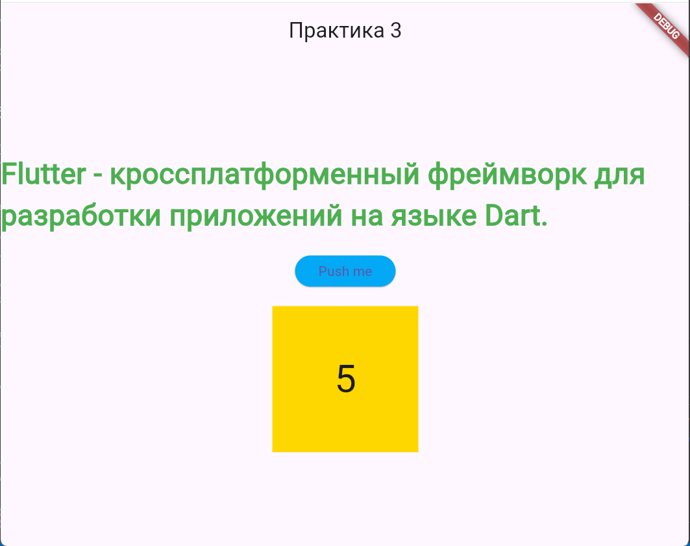
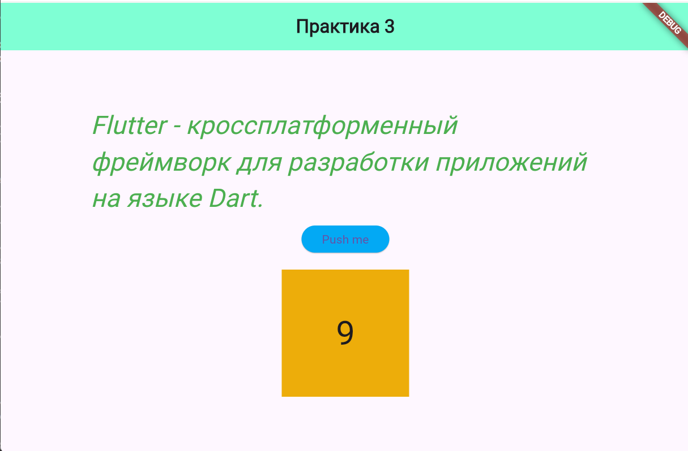

# Практическое задание № 3.
## Работа с компонентами пользовательского интерфейса. Работа с основными виджетами. Работа с цветами, шрифтами и компоновкой элементов

В ходе выполнения практического задания было создано работающее приложение с текстом, кнопкой и контейнером:

Далее в приложении были добавлены новые цвета и изменены шрифты:
